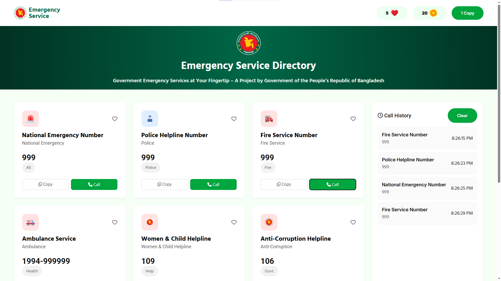
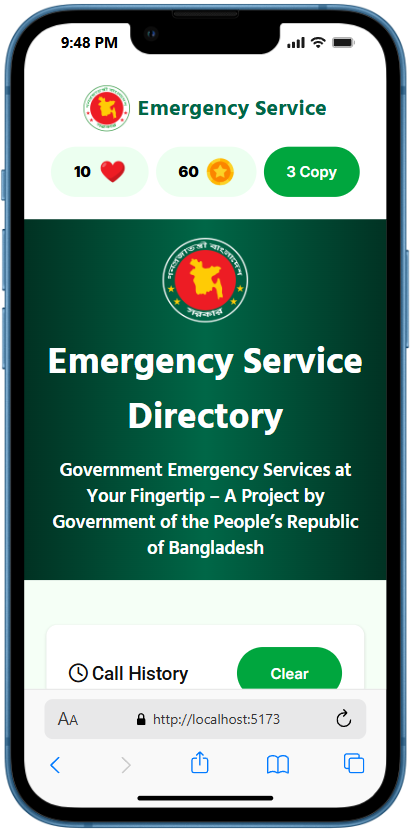

# Emergency Service Directory

A modern, responsive web application providing quick access to government emergency service numbers in Bangladesh. This project helps citizens easily find and call essential emergency hotlines such as police, fire service, ambulance, and more.

---

### 6. Answer the following questions clearly:

1. What is the difference between **getElementById, getElementsByClassName, and querySelector / querySelectorAll**?  

**Answer:**  
- `getElementById` → Returns **one element** by its unique id.
- `getElementsByClassName` → Returns **all elements** with a specific class (HTMLCollection).
- `querySelector` → Returns **the first element** matching a CSS selector.
- `querySelectorAll` → Returns **all elements** matching a CSS selector (NodeList).


2. How do you **create and insert a new element into the DOM**?  

**Answer:**  
```
let newEl = document.createElement('div');  
newEl.textContent = "Hello World";  
document.body.appendChild(newEl);  
```


3. What is **Event Bubbling** and how does it work?  

**Answer:**  
- Event starts at the **target element** and then **bubbles up** to its parent elements.
- Example: Click on a button → first button, then div, then body.


4. What is **Event Delegation** in JavaScript? Why is it useful?  

**Answer:**  
- Instead of adding event on each child, we **add event to parent** and catch events from children.
- Useful for **dynamic elements** and improves performance.


5. What is the difference between **preventDefault() and stopPropagation()** methods?  

**Answer:**  
`preventDefault()` → Stops default **browser action** (like form submit or link click).  
`stopPropagation()` → Stops the event from **bubbling or capturing** further. 


---

## 📑 Table of Contents
- ✨ [Features](#features)
- 🖼️ [Screenshots](#screenshots)
- ⚙️ [Usage](#usage)
- 🛠️ [Technologies Used](#technologies-used)
- 📂 [Folder Structure](#folder-structure)
- 📜 [License](#license)
- 👨‍💻 [Author](#author)
- 💡 [JavaScript Q&A](#6-answer-the-following-questions-clearly)


---


## 🚀 Live Demo
[View on GitHub Pages](https://shariar-ahamed.github.io/Government-Emergency-Services-Directory/)

---

## Features
- 🚨 **Quick Access to Emergency Numbers**: Instantly find and call national emergency, police, fire, ambulance, and other helplines.
- 📱 **Responsive Design**: Fully optimized for both desktop and mobile devices.
- 🕒 **Call History**: View and clear your recent call attempts for convenience.
- ❤️ **Favorites & Rewards**: Mark hotlines as favorites and earn coins for using the service.
- 🇧🇩 **Bangladesh Focused**: All numbers and services are tailored for Bangladesh.

---


## Desktop View:


## Mobile View:
<!-- Mobile Screenshot -->
<p align="center">
  
</p>


---

## Usage
1. **Clone the repository:**
	 ```sh
	 git clone https://github.com/Shariar-Ahamed/Government-Emergency-Services-Directory.git
	 ```
2. **Open `index.html` in your browser.**

---

## Technologies Used
- HTML5, CSS3 (with PostCSS)
- JavaScript (Vanilla)

---

## Folder Structure
```
├── index.html
├── style.css
├── js/
│   └── scripts.js
├── images/
├── Screenshot/
│   ├── pc_screenshot.png
│   └── phone_screenshot.png
└── ...
```

---

## License
This project is open-source and free to use for educational and non-commercial purposes.

---

## Author
**Shariar Ahamed**

For any suggestions or issues, please open an issue on the repository.

